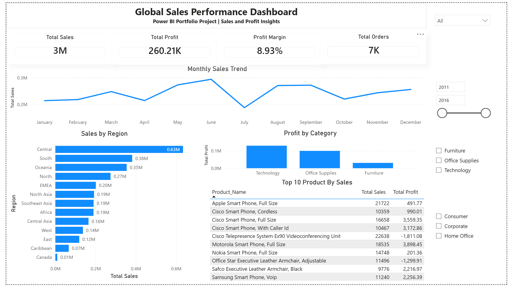
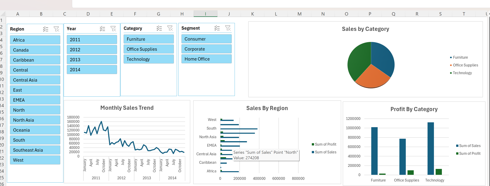

# Global Sales Performance Dashboard

## Project Overview
This portfolio project analyzes global sales data using:

- Excel (cleaning + pivot dashboards)
- Power BI (interactive reporting)
- SQL (business insight queries)

## Tools Used
- Microsoft Excel  
- Power BI Desktop  
- SQL (PostgreSQL/MySQL)

## Key Insights
- Monthly sales trends and seasonality  
- Regional performance differences  
- Category profitability comparison  
- Top 10 products driving revenue  

## Dashboard Preview

### Power BI Dashboard

### Excel Dashboard

